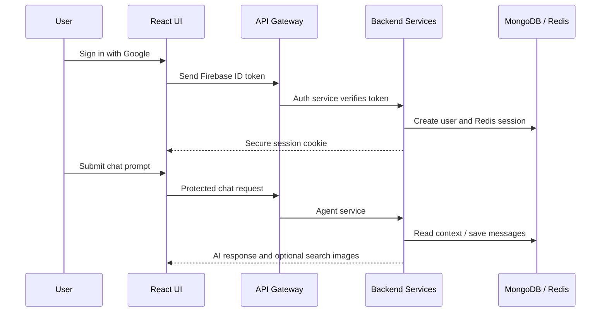
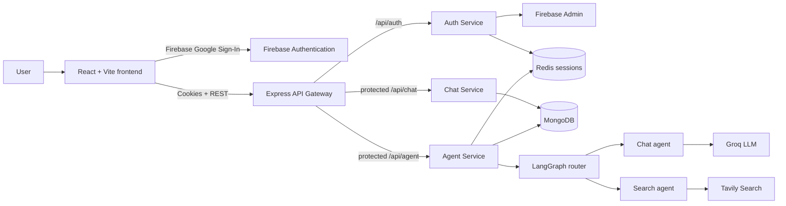

# Kaido — AI Chat Platform

<p align="center">
  <strong>Part 1: an authenticated, service-based AI chat application with persistent conversations and intelligent routing.</strong>
</p>

> **Status:** Part 1 complete · Part 2: specialist agents · Part 3: production deployment

## Project status

Kaido is a full-stack AI chat application that combines a polished React interface with an API gateway, independent backend services, persistent chat history, and a LangGraph-powered routing workflow. It is designed as an incremental build: first a reliable platform foundation, then specialist agents, then production deployment.

This README describes **Part 1 only**. The implemented experience includes Google sign-in, conversation persistence, session-backed access control, general chat, and web-search-assisted responses.

Some agent options visible in the interface—Coding, PDF, PPT, and Image/Vision—are currently scaffolds for later work. They are intentionally not presented here as completed features.

## Highlights

- Google sign-in through Firebase Authentication
- Server-side verification of Firebase ID tokens
- Redis-backed, HTTP-only sessions with a seven-day lifetime
- API gateway that applies authentication before forwarding protected requests
- Create, list, select, and retitle conversations
- Persistent messages and conversations in MongoDB
- Recent conversational memory stored in Redis (up to 20 messages, cached for 24 hours)
- Agent selection from the chat UI: Auto, Chat, and Search
- Auto-routing through LangGraph; a router selects an appropriate agent for a prompt
- Tavily-powered web search with returned image results
- Markdown rendering, GitHub-flavoured tables/lists, code blocks, and copy-code action
- Responsive dark chat interface built with React and Tailwind CSS

## User flow



## Architecture



## Stack

| Area | Tools used |
| --- | --- |
| Frontend | React, Vite, Redux Toolkit, Tailwind CSS, Axios |
| Authentication | Firebase Authentication, Firebase Admin |
| Backend | Node.js, Express, express-http-proxy |
| Data | MongoDB with Mongoose, Redis with ioredis |
| AI orchestration | LangChain, LangGraph |
| AI/search providers | Groq, Google Generative AI SDK, Tavily |
| Developer tooling | Docker Compose (Redis), Nodemon, ESLint |

## Repository layout

```text
frontend/                 # React user interface
backend/
  gateway/                # Gateway, CORS and route protection
  services/
    auth/                 # Firebase token verification and sessions
    chat/                 # Conversations and message persistence
    agent/                # LangGraph workflow and AI agents
  shared/Redis/           # Shared Redis client
  docker-compose.yml      # Local Redis container
```

## Local setup

### Prerequisites

- Node.js 20+
- MongoDB instance
- Redis instance (Docker is supported)
- Firebase project with Google sign-in enabled
- API keys for Groq, Google Generative AI, and Tavily

### 1. Start Redis

From `backend/`:

```bash
docker compose up -d
```

### 2. Install dependencies

Install packages separately in each app that has a `package.json`:

```bash
cd backend && npm install
cd gateway && npm install
cd ../services/auth && npm install
cd ../chat && npm install
cd ../agent && npm install
cd ../../../frontend && npm install
```

### 3. Create local environment files

Never commit these files. Use the following as a names-only reference; replace values with your own local values.

`backend/gateway/.env`

```env
PORT=
FRONTEND_URL=
AUTH_SERVICE=
CHAT_SERVICE=
AGENT_SERVICE=
REDIS_URL=
```

`backend/services/auth/.env`

```env
PORT=
MONGODB_URI=
REDIS_URL=
```

`backend/services/chat/.env`

```env
PORT=
MONGODB_URI=
```

`backend/services/agent/.env`

```env
PORT=
MONGODB_URI=
REDIS_URL=
CHAT_SERVICE=
GROQ_API_KEY=
GOOGLE_API_KEY=
TAVILY_API_KEY=
```

`frontend/.env`

```env
VITE_SERVER_URL=
VITE_FIREBASE_API_KEY=
```

The Auth service also requires Firebase Admin credentials at `backend/services/auth/serviceAccountKey.json`. This must stay private and must be ignored by Git.

### 4. Run services

Open separate terminals and start the gateway, auth, chat, agent, and frontend applications with each folder's `npm run dev` command. Use the ports defined in the environment files and point the gateway service URLs at the corresponding local services.

## Roadmap

### Part 2

- Implement the Coding, PDF, PPT, and Vision agents end to end
- Add file upload and microphone functionality behind the existing UI controls
- Make agent routing responses structured and validate them before use
- Add loading, retry, and error states for a smoother chat experience
- Add automated tests and API validation

### Part 3 — deployment

- Deploy the frontend, gateway, and each backend service
- Provision managed MongoDB and Redis
- Move every secret to the hosting platform's environment-variable manager
- Set production cookie flags (`secure: true`) and production CORS origin
- Add logging, health checks, and a basic CI pipeline

## Project decisions

| Decision | Why it matters |
| --- | --- |
| API gateway | Keeps frontend communication simple and centralises route protection. |
| Separate auth, chat, and agent services | Makes responsibilities clear and supports independent scaling later. |
| MongoDB for persistent history | Retains conversations and messages across sessions. |
| Redis for sessions and recent memory | Provides fast session lookup and avoids sending the entire history to the model each time. |
| LangGraph workflow | Makes routing logic explicit and extensible as new agents are added. |

## Contributing

This is currently a personal learning and portfolio project. Constructive feedback, architecture suggestions, and bug reports are welcome.

## Security notes before publishing

- The uploaded project archive included `.env` files and a Firebase service-account key. Do not upload that archive to GitHub or share it publicly.
- If the Firebase key or any API key has ever reached a public repository, revoke/rotate it immediately.
- Keep `.env` and `serviceAccountKey.json` in `.gitignore`; commit only `.env.example` files with blank values.

## Author

Built as an incremental project: Part 1 establishes the authenticated AI-chat platform and service foundation; later parts expand the agent capabilities and deploy it.

---

If you found this project useful, consider giving it a star when the public repository is live.
