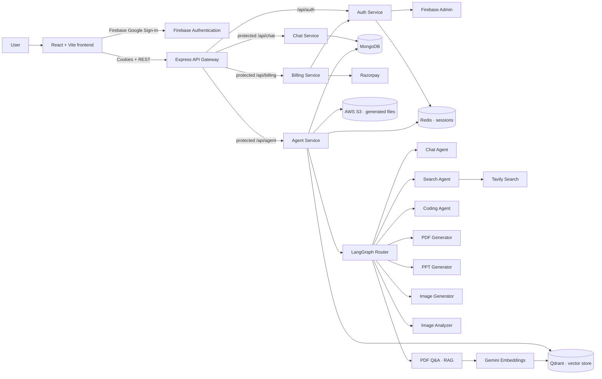

# Kaido — Multi-Agent AI Platform

<p align="center">
  <strong>A structured, multi-agent AI platform — not just a single chatbot, but a routed system of specialists working behind one clean chat interface.</strong>
</p>

<p align="center">
  
  
  
  
  
  
  
  
  
</p>

> **Status:** Core platform complete — authentication, billing, and eight specialist agents are live. Production deployment (AWS) is in progress.

## Table of Contents

- [Overview](#overview)
- [Highlights](#highlights)
- [Screenshots](#screenshots)
- [Architecture](#architecture)
- [Engineering Highlights](#engineering-highlights)
- [Stack](#stack)
- [Repository layout](#repository-layout)
- [Local setup](#local-setup)
- [How routing works](#how-routing-works)
- [Roadmap](#roadmap)
- [Project decisions](#project-decisions)

## Overview

Kaido is a full-stack AI platform built around a **LangGraph-powered routing engine** that reads a user's intent and dispatches it to the right specialist agent — general chat, live web search, code assistance, document generation, presentation generation, AI image generation, image understanding, or PDF-based question answering.

It's built the way real AI products are structured: an API gateway in front of independently deployable services, persistent history, rate-limited and credit-metered agent usage, and a billing system to support paid plans — not just a wrapper around a single LLM call.

Most personal AI projects stop at "call one API and display the response." Kaido was built to go a level deeper — understanding how routing, rate-limiting, retrieval, and billing actually fit together in a real product, not just a demo.

<p align="center">
🧩 5 microservices &nbsp;·&nbsp; 🤖 8 specialist agents &nbsp;·&nbsp; 💳 Full billing integration &nbsp;·&nbsp; 📄 RAG-powered PDF Q&A
</p>

## Highlights

**Platform & Auth**
- Google Sign-In via Firebase Authentication, verified server-side with Firebase Admin
- Redis-backed, HTTP-only sessions (7-day lifetime)
- API gateway that centralizes CORS, cookie handling, and auth middleware in front of every protected service
- Persistent conversations and messages in MongoDB, with a fast Redis-cached recent-memory window for AI context

**Eight Specialist Agents, One Router**
- **Auto-routing** — a LangGraph router reads the prompt (and any attached file) and picks the right agent automatically
- **Chat** — general conversation, reasoning, explanations, and writing help
- **Search** — Tavily-powered live web search with image results, for anything time-sensitive or current
- **Coding** — an intent-aware coding assistant: classifies the request (generation, review, explanation, debugging, optimization, conversion, or documentation) before responding, so the answer matches what was actually asked
- **PDF Generator** — turns a topic into a structured, downloadable PDF report
- **PPT Generator** — turns a topic into a structured, downloadable slide deck
- **Image Generator** — converts a request into a detailed, professional image-generation prompt and produces an image
- **Image Analyzer** — reads an uploaded image: extracts text, explains charts/diagrams, answers questions about what's in it
- **PDF Q&A (RAG)** — a full retrieval-augmented pipeline: uploaded PDFs are chunked, embedded, and stored in a vector database, and answers are generated strictly from the retrieved content — never made up

**Usage Controls & Monetization**
- Per-agent rate limiting (Redis-backed, sliding per-minute windows)
- Credit-based usage system — credits are deducted only after a successful response
- Razorpay payment integration for plan upgrades, with signature-verified payment confirmation
- Generated files (PDFs, PPTs) stored on AWS S3 and served back via download links

**Interface**
- Responsive, dark-mode chat UI (React + Tailwind), with a dedicated agent selector, billing drawer, and file-upload support
- Markdown rendering with GitHub-flavored tables/lists, syntax-highlighted code blocks, and one-click copy
- Loading and response states for a smoother, more polished chat experience

## Screenshots

<!-- Screenshot files live in /screenshots — add billing.png and image-gen.png when ready. -->

| | |
|---|---|
| **Sign-in** <br>  | **Chat Interface** <br>  |
| **Structured AI Responses** <br>  | **Document Generation (PDF/PPT)** <br>  |
| **Live Code Preview (Artifacts)** <br>  | *Billing screenshot — coming soon* |

## Architecture



## Engineering Highlights

A few decisions worth calling out beyond "which libraries were used":

- **File-type-first routing** — when a file is attached, its MIME type decides the agent directly (PDF → RAG, image → analyzer). No extra LLM call is spent just figuring out what kind of file was uploaded.
- **Per-PDF isolated vector collections** — every uploaded PDF gets its own Qdrant collection, so one document's chunks can never leak into another document's answers.
- **Signature-verified payments** — every Razorpay payment is confirmed server-side via HMAC-SHA256 signature verification before any credits are granted; amounts and credits are always read from the server's own record, never trusted from the client.
- **Credits deducted after generation, not before** — a failed agent call (LLM error, timeout) never costs the user credits.
- **Stateless services, Redis-backed sessions** — no service keeps session state in local memory; every session lives in Redis. This means any service can run as multiple instances behind a load balancer without users being tied to a specific server — the services are built to scale horizontally, even though the current deployment is single-instance.

## Stack

| Area | Tools used |
| --- | --- |
| Frontend | React, Vite, Redux Toolkit, Tailwind CSS, Axios |
| Authentication | Firebase Authentication, Firebase Admin |
| Backend | Node.js, Express, express-http-proxy, Multer |
| Data | MongoDB with Mongoose, Redis with ioredis |
| AI orchestration | LangChain, LangGraph |
| AI/search providers | Groq, OpenRouter, Google Generative AI (Gemini), Tavily |
| Retrieval / RAG | Qdrant (vector DB), Gemini Embeddings, LangChain text splitters, pdf-parse |
| Payments | Razorpay |
| File storage & generation | AWS S3, pdfkit, pptxgenjs |
| Developer tooling | Docker Compose (Redis), Nodemon, ESLint |

## Repository layout

```text
frontend/                 # React user interface
backend/
  gateway/                # Gateway, CORS and route protection
  services/
    auth/                 # Firebase token verification, sessions, plan/credit sync
    chat/                 # Conversations and message persistence
    billing/              # Razorpay orders, payment verification, plans
    agent/                # LangGraph workflow and all specialist agents
      agents/              # chat, search, coding, pdf, ppt, vision, imageAnalyzer, pdfRag
      config/               # LLM routing, embeddings, vector store, rate limits, S3
      utils/                # credit deduction, PDF/PPT generation, S3 helpers
  shared/Redis/            # Shared Redis client
  docker-compose.yml        # Local Redis container
```

## Local setup

### Prerequisites

- Node.js 20+
- MongoDB instance
- Redis instance (Docker is supported)
- A Qdrant instance (cloud or self-hosted)
- Firebase project with Google sign-in enabled
- API keys: Groq, Google Generative AI, Tavily, Razorpay, AWS (S3)

### 1. Start Redis

From `backend/`:

```bash
docker compose up -d
```

### 2. Install dependencies

Install packages separately in each app that has a `package.json`:

```bash
cd backend/gateway && npm install
cd ../services/auth && npm install
cd ../chat && npm install
cd ../billing && npm install
cd ../agent && npm install
cd ../../../frontend && npm install
```

### 3. Create local environment files

Never commit these files. Use the following as a names-only reference; replace values with your own local values.

`backend/gateway/.env`

```env
PORT=
FRONTEND_URL=
AUTH_SERVICE=
CHAT_SERVICE=
AGENT_SERVICE=
BILLING_SERVICE=
```

`backend/services/auth/.env`

```env
PORT=
MONGODB_URI=
REDIS_URL=
```

`backend/services/chat/.env`

```env
PORT=
MONGODB_URI=
```

`backend/services/billing/.env`

```env
PORT=
MONGODB_URI=
AUTH_SERVICE=
RAZORPAY_KEY_ID=
RAZORPAY_KEY_SECRET=
```

`backend/services/agent/.env`

```env
PORT=
MONGODB_URI=
REDIS_URL=
CHAT_SERVICE=
GROQ_API_KEY=
GOOGLE_API_KEY=
OPENROUTER_API_KEY=
TAVILY_API_KEY=
QDRANT_URL=
AWS_ACCESS_KEY_ID=
AWS_SECRET_ACCESS_KEY=
AWS_REGION=
AWS_S3_BUCKET=
```

`frontend/.env`

```env
VITE_SERVER_URL=
VITE_FIREBASE_API_KEY=
VITE_RAZORPAY_KEY_ID=
```

The Auth service also requires Firebase Admin credentials at `backend/services/auth/serviceAccountKey.json`. This must stay private and must be ignored by Git.

### 4. Run services

Open separate terminals and start the gateway, auth, chat, billing, agent, and frontend applications with each folder's `npm run dev` command. Point the gateway's service URLs at the corresponding local services and ports.

## How routing works

Every chat request carries an `agent` field. If it's a specific agent (Chat, Search, Coding, PDF, PPT, Vision), the request goes straight there. If it's set to **Auto**:

1. If a file is attached, its MIME type decides the path directly — a PDF goes to the RAG agent, an image goes to the Image Analyzer — no extra model call needed.
2. If there's no file, a routing model reads the prompt and returns a single decision (`chat`, `search`, `coding`, `pdf`, `ppt`, or `vision`) based on intent.

This keeps routing fast (file-based decisions skip the LLM call entirely) and keeps the system easy to extend — adding a new agent means adding one more node to the graph.

## Roadmap

### Part 3 — Deployment

- Deploy the frontend, gateway, and every backend service to AWS
- Provision managed MongoDB, Redis, and Qdrant
- Move every secret to AWS's environment-variable / secrets manager
- Set production cookie flags (`secure: true`) and a locked-down production CORS origin
- Add logging, health checks, and a basic CI/CD pipeline
- Switch Razorpay from test mode to live mode

## Project decisions

| Decision | Why it matters |
| --- | --- |
| API gateway | Keeps frontend communication simple and centralizes route protection across five services. |
| Independent microservices | Auth, Chat, Billing, and Agent each own their responsibility and can scale or deploy independently. |
| File-type-first routing | When a file is attached, its MIME type decides the agent directly — faster and cheaper than an extra LLM call. |
| Per-PDF vector collections | Each uploaded PDF gets its own Qdrant collection, so one document's context never leaks into another's answers. |
| Redis for sessions, rate limits, and recent memory | One fast store for everything that needs to be read on nearly every request. |
| Credits deducted after generation, not before | A failed agent call never costs the user credits. |
| Stateless services (Redis-backed sessions) | No session state lives in a service's local memory, so every service is designed to run multiple instances behind a load balancer — horizontal scaling without a rewrite. |
| LangGraph workflow | Makes routing logic explicit, inspectable, and easy to extend with new agents. |

## Contributing

This is currently a personal learning and portfolio project. Constructive feedback, architecture suggestions, and bug reports are welcome.

## Security notes before publishing

- Never commit `.env` files or the Firebase `serviceAccountKey.json` — keep both in `.gitignore` and commit only `.env.example` files with blank values.
- If any API key or credential has ever reached a public repository, revoke and rotate it immediately.
- Razorpay keys in this repository's local setup are test-mode keys only; production keys belong in the hosting platform's secrets manager, never in source control.

## Author

Built as an incremental project — a routed, multi-agent AI platform with real usage controls and billing, not a single-endpoint chatbot demo.

---

If you found this project useful, consider giving it a star when the public repository is live.